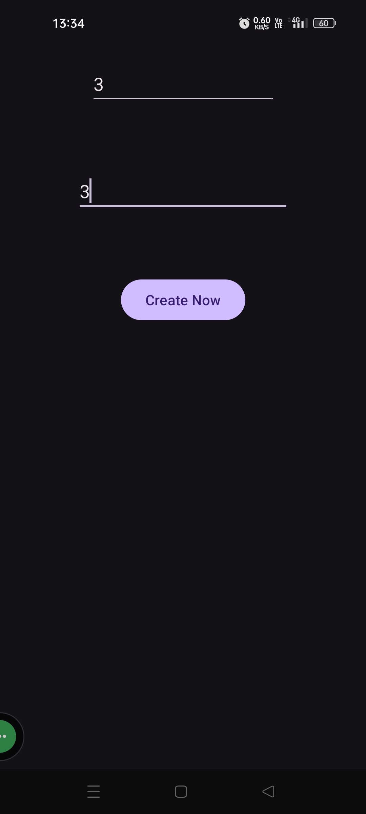
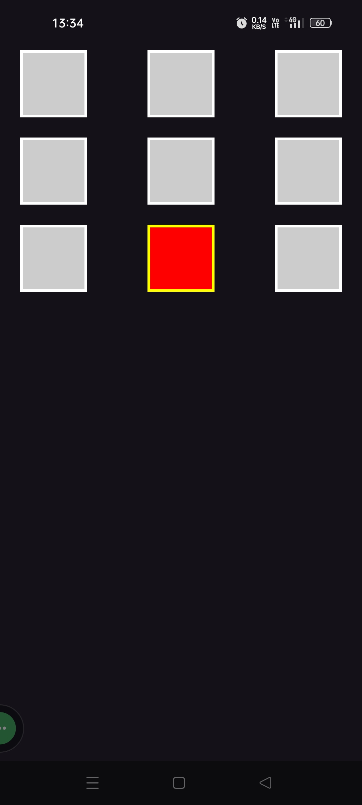
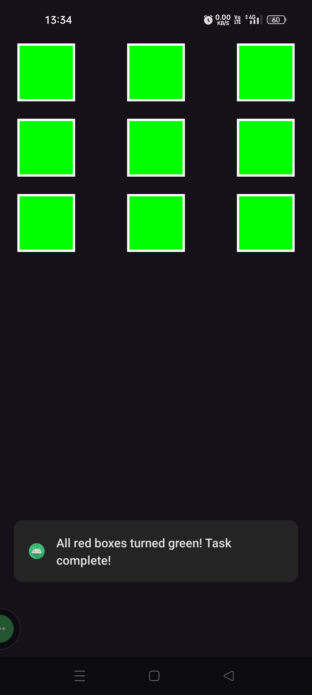

# 🎮 ColorBoxGame

A fun and interactive Android game that challenges players to color the grid boxes based on logic and sequence.

## 🧠 Game Logic
- Click on red boxes to turn nearby grey boxes red.
- Once all boxes are red, a green box appears.
- Green boxes convert red boxes to green.
- Objective: turn all boxes green to win.

## 🛠️ Built With
- Java & Android Studio
- GridView and Custom Adapters

## 📱 Screenshots

## 🚀 How to Run
1. Clone the repo
2. Open in Android Studio
3. Run on emulator or Android device

## 🙋‍♂️ Author
**Vivek Patil**  
📧 vivekpatilappdev@gmail.com  
🔗 [LinkedIn](https://www.linkedin.com/in/vivek-patil-4835001b5) *(Add your real link)*

## 🌟 Star this repo if you enjoyed the game!
